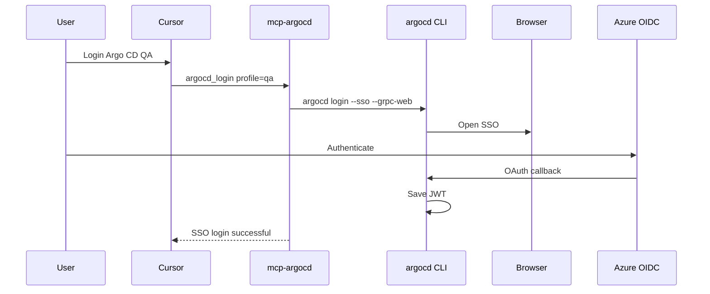

# @godrix/mcp-argocd

MCP Server for **Argo CD**: multi-environment profiles (qa/stg/prod), SSO or API-key auth, application search cache, and REST tools from the bundled OpenAPI catalog.

## Features

- **Multi-environment profiles** — single `ARGOCD_URL` or `ARGOCD_PROFILES` + `ARGOCD_URL_PROFILES`
- **SSO login** — `argocd_login` via `argocd` CLI (Azure OIDC); or **API key** via env / `argocd_set_api_key`
- **Application tools** — list, search (LIKE cache), diff, manifests, diagnose, sync (opt-in)
- **MCP App — observabilidade** — widget inline com health, sync, Git, conditions e link para o Argo CD UI
- **Generic API** — `search-argocd-endpoints` + `call-argocd-api` over full swagger catalog
- **Resources & prompts** — profiles, priority apps, settings, health-check workflows
- **Read-only by default** — `ARGOCD_READ_ONLY=true` blocks mutations

## Prerequisites

| Requirement | SSO login | API key only |
|---|---|---|
| **Node.js 20+** | Yes | Yes |
| **Argo CD CLI** (`argocd`) | Yes | No |

> Install `argocd` (Argo **CD**), not `argo` (Argo **Workflows**). See [argo vs argocd](#argo-vs-argocd).

## Quick start (Cursor / npx)

No clone required after publish:

```json
{
  "mcpServers": {
    "argocd": {
      "command": "npx",
      "args": ["-y", "@godrix/mcp-argocd"],
      "env": {
        "ARGOCD_URL": "https://argocd-qa.example.io",
        "ARGOCD_API_KEY": "eyJhbGciOi...",
        "ARGOCD_READ_ONLY": "true"
      }
    }
  }
}
```

Multi-environment:

```json
{
  "mcpServers": {
    "argocd": {
      "command": "npx",
      "args": ["-y", "@godrix/mcp-argocd"],
      "env": {
        "ARGOCD_DEFAULT_PROFILE": "qa",
        "ARGOCD_PROFILES": "qa,stg,prod",
        "ARGOCD_URL_PROFILES": "https://qa.example.io,https://stg.example.io,https://prod.example.io",
        "ARGOCD_READ_ONLY": "true"
      }
    }
  }
}
```

Restart Cursor after saving. Then ask the agent to run `argocd_auth_status` or `argocd_login`.

## Installation

### Node.js 20+

| Platform | Install |
|---|---|
| **macOS** | [nodejs.org](https://nodejs.org/) or `brew install node@20` |
| **Linux (Debian/Ubuntu)** | `curl -fsSL https://deb.nodesource.com/setup_20.x \| sudo -E bash -` → `sudo apt install -y nodejs` |
| **Linux (Fedora/RHEL)** | `sudo dnf install nodejs` or [nvm](https://github.com/nvm-sh/nvm) |
| **Windows** | [nodejs.org](https://nodejs.org/) or `winget install OpenJS.NodeJS.LTS` |

```bash
node --version   # v20+
```

### Argo CD CLI (for SSO)

| Platform | Install |
|---|---|
| **macOS** | `brew install argocd` |
| **Linux (amd64)** | `curl -sSL -o /usr/local/bin/argocd https://github.com/argoproj/argo-cd/releases/latest/download/argocd-linux-amd64 && sudo chmod +x /usr/local/bin/argocd` |
| **Linux (arm64)** | Use `argocd-linux-arm64` in the URL above |
| **Windows (Scoop)** | `scoop install argocd` |
| **Windows (Chocolatey)** | `choco install argocd-cli` |
| **Windows (manual)** | [Latest release](https://github.com/argoproj/argo-cd/releases/latest) → `argocd-windows-amd64.exe` → add to `PATH` |

Docs: [Argo CD CLI installation](https://argo-cd.readthedocs.io/en/stable/cli_installation/)

```bash
argocd version --client
```

### From source

```bash
git clone <repo-url> mcp-argocd
cd mcp-argocd
npm install
npm run build
cp .env.example .env   # edit URLs / keys
```

Point Cursor at the build output:

```json
{
  "mcpServers": {
    "argocd": {
      "command": "node",
      "args": ["/absolute/path/to/mcp-argocd/build/server.js"],
      "env": {
        "ARGOCD_URL": "https://argocd-qa.example.io",
        "ARGOCD_READ_ONLY": "true"
      }
    }
  }
}
```

## MCPB install (Claude Desktop / local bundle)

Alternative to npx for clients that support `.mcpb` files:

1. Clone the repo and install: `npm install && npm run build`
2. `npm run pack:mcpb` — bundle with `manifest.json`, `build/`, `swagger.txt`, and `node_modules`
3. Smaller bundle: `npm run pack:mcpb:slim`
4. Install the `.mcpb` in your client and fill in URL / API key / profiles in the UI

The bundle form maps to the same env vars (`ARGOCD_URL`, `ARGOCD_API_KEY`, `ARGOCD_PROFILES`, etc.). **SSO still requires** the `argocd` CLI on `PATH` and a desktop browser.

CI publishes the `.mcpb` to GitHub Releases on each version bump (see `.github/workflows/release.yml`).

## Configuration

### Environment profiles

Two **mutually exclusive** modes:

**Single instance** — only `ARGOCD_URL` (implicit profile `default`):

```bash
ARGOCD_URL=https://argocd-qa.example.io
```

**Multiple environments** — all three required (do **not** set `ARGOCD_URL`):

```bash
ARGOCD_DEFAULT_PROFILE=qa
ARGOCD_PROFILES=qa,stg,prod
ARGOCD_URL_PROFILES=https://qa.example.io,https://stg.example.io,https://prod.example.io
```

Optional per profile: `ARGOCD_PROFILE_<NAME>_CONTEXT`, `_LABEL`, `_URL`.

### Environment variables

| Variable | Required | Default | Description |
|---|---|---|---|
| `ARGOCD_URL` | Single mode | — | Argo CD base URL |
| `ARGOCD_DEFAULT_PROFILE` | Multi mode | — | Default profile name (must be in `ARGOCD_PROFILES`) |
| `ARGOCD_PROFILES` | Multi mode | — | Comma-separated profile names |
| `ARGOCD_URL_PROFILES` | Multi mode | — | Comma-separated URLs (same order as profiles) |
| `ARGOCD_API_KEY` | No | — | Bearer token (default profile or single instance) |
| `ARGOCD_API_KEY_<PROFILE>` | No | — | Per-profile API key (e.g. `ARGOCD_API_KEY_QA`) |
| `ARGOCD_API_KEYS` | No | — | Comma-separated keys (same order as `ARGOCD_PROFILES`) |
| `ARGOCD_TOKEN` / `ARGOCD_TOKEN_<PROFILE>` | No | — | Aliases for API key vars |
| `ARGOCD_READ_ONLY` | No | `true` | Block sync and other mutations |
| `ARGOCD_ALLOW_REFRESH` | No | `true` | Allow `refresh-application` |
| `ARGOCD_APP_CACHE_ENABLED` | No | `true` | In-memory application name cache |
| `ARGOCD_APP_CACHE_TTL_SECONDS` | No | `300` | Cache TTL |
| `ARGOCD_PRIORITY_APPS` | No | — | Comma-separated bookmark app names |
| `ARGOCD_PRIORITY_APPS_<PROFILE>` | No | — | Per-profile priority apps |
| `ARGOCD_GRPC_WEB` | No | `true` | Pass `--grpc-web` to `argocd login` |
| `ARGOCD_CONFIG` | No | `~/.config/argocd/config` | Path to argocd CLI config |

Legacy: `ARGOCD_PROFILES_FILE` loads JSON; env vars override file entries.

## Authentication

Use **one method per profile**: API key **or** CLI login.

### Option A — API key (recommended for MCP / CI)

Token from Argo CD UI (**User Settings → API tokens**) or `argocd account generate-token`.

```bash
# single instance
ARGOCD_API_KEY=eyJhbGciOi...

# multi-env
ARGOCD_API_KEY_QA=eyJ...
ARGOCD_API_KEYS=key-qa,key-stg,key-prod
```

Runtime (current MCP session only):

```json
argocd_set_api_key { "profile": "qa", "apiKey": "eyJ..." }
```

**Priority:** memory → env per profile → `ARGOCD_API_KEYS` → `ARGOCD_API_KEY` → CLI config.

### Option B — SSO login (interactive)

No `USE_SSO` env var — SSO is the default for `argocd_login`.

```
1. Configure profiles (ARGOCD_URL or multi-env vars)
2. Agent calls argocd_login { "profile": "qa" }
3. MCP runs: argocd login <host> --sso --name <context> --grpc-web
4. Browser opens → Microsoft/Azure OIDC
5. JWT saved to ~/.config/argocd/config  (Windows: %USERPROFILE%\.config\argocd\config)
6. MCP reads token for subsequent API calls
7. Verify: argocd_auth_status → authenticated: true
```



**Tools:**

```json
argocd_login { "profile": "qa" }
```

```json
argocd_login { "profile": "qa", "sso": false, "username": "admin", "password": "..." }
```

**Manual (terminal)** — MCP reuses the same config:

```bash
argocd login argocd-qa.example.io --sso --grpc-web --name qa
```

When the JWT expires, run `argocd_login` again or switch to an API key.

**How the agent knows the token expired:**

| Signal | What it means |
|---|---|
| `argocd_auth_status` | `tokenValid: false` + `recommendedAction` with `argocd_login` |
| Any API tool returns **401/403** | Error message includes `authentication failed` and tells the agent to re-login or rotate the API key |
| `list-argocd-profiles` with `validateTokens: true` | Live probe without calling other tools |

`tokenPresent: true` only means a token exists in env/CLI config — use `argocd_auth_status` to confirm it still works.

## MCP tools

### Core

| Tool | Description |
|---|---|
| `list-argocd-profiles` | Profiles, URLs, auth status |
| `argocd_login` | SSO or username/password via CLI |
| `argocd_set_api_key` | API token in memory for this session |
| `argocd_auth_status` | Auth status per profile |
| `get-argocd-settings` | Public settings |
| `get-argocd-userinfo` | User + groups |
| `search-argocd-endpoints` | Search swagger catalog |
| `describe-argocd-endpoint` | Endpoint parameters |
| `call-argocd-api` | Generic REST call |

### Applications

| Tool | Description |
|---|---|
| `list-applications` | List/filter; `nameContains` for substring via cache |
| `search-applications` | LIKE search on cached names |
| `refresh-application-cache` | Force cache refresh |
| `application-cache-status` | Cache TTL / count per profile |
| `list-priority-applications` | Apps from `ARGOCD_PRIORITY_APPS` |
| `get-application` | Full status |
| `get-application-diff` | Server-side diff |
| `get-application-manifests` | Rendered manifests |
| `refresh-application` | Refresh from Git |
| `get-application-resource-tree` | Resource tree |
| `get-application-pod-logs` | Pod logs |
| `diagnose-application` | Status + tree + events + pod logs |
| `view-application-observability` | **MCP App** — painel interativo (health, sync, Git, conditions, unhealthy) |
| `refresh-application-observability` | Recarrega dados do widget (visível só para a UI) |
| `sync-application` | Trigger sync (`ARGOCD_READ_ONLY=false`) |
| `terminate-application-operation` | Cancel operation |

### Infra

| Tool | Description |
|---|---|
| `list-projects` | Argo CD AppProjects |

### Resources

| URI | Description |
|---|---|
| `argocd://profiles` | Profiles + auth |
| `argocd://priority-apps` | Priority app names |
| `argocd://settings/{profile}` | Public settings (cached) |
| `argocd://application-index/{profile}` | Cached application names |

### Prompts

| Prompt | Description |
|---|---|
| `daily-argocd-healthcheck` | Priority + degraded + outofsync sweep |
| `investigate-outofsync` | Diff + recommendation |
| `safe-sync-application` | RBAC + diff before sync |

## MCP App — Observabilidade

A tool `view-application-observability` abre um **widget inline** (quando o host suporta MCP Apps) com o estado de uma application:

- Badges de **health** e **sync**
- Metadados Git (repo, path, revisions)
- **Conditions** reportadas pelo Argo CD
- Lista de recursos **unhealthy** (resource tree, sem pod logs)
- Botão **Abrir no Argo CD** (`openLink` para a URL da application)
- Botão **Atualizar** (chama `refresh-application-observability` via `callServerTool`)

Em hosts **sem** suporte a MCP App (ex. alguns modos do Cursor), a mesma tool retorna `structuredContent` JSON + resumo em texto — o agente continua operacional.

```text
view-application-observability(profile: "qa", name: "my-service")
```

> Widget visível em clientes com `@modelcontextprotocol/ext-apps` (ex. Claude com connectors). No Cursor depende da versão/feature de MCP Apps.

## Recommended workflow

1. `list-argocd-profiles` — check environments and auth
2. `argocd_login` (SSO) or set `ARGOCD_API_KEY` / `argocd_set_api_key`
3. `search-applications` or `list-applications` for discovery
4. `diagnose-application` / `get-application-diff` for troubleshooting
5. `call-argocd-api` for anything else in swagger

## Development

```bash
npm install
npm run build
npm test
npm run dev:mcp          # MCP Inspector
npm run pack:mcpb        # local .mcpb bundle
npm run pack:mcpb:slim   # production-sized bundle
```

## argo vs argocd

| CLI | Product |
|---|---|
| `argo` | Argo **Workflows** |
| `argocd` | Argo **CD** (this MCP) |

## License

MIT
